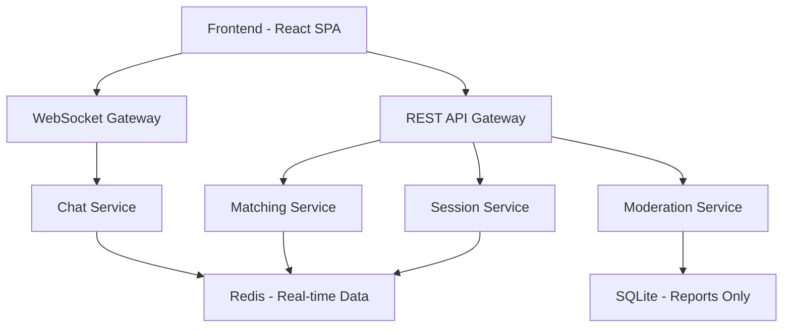

# Design Document

## Overview

StrangEars is a web-based anonymous chat platform that connects users for one-to-one emotional support conversations. The system uses a simple matching algorithm to pair "venters" (those who need to talk) with "listeners" (those willing to listen). The platform prioritizes anonymity, simplicity, and emotional safety.

## Architecture

### High-Level Architecture



### Technology Stack

**Frontend:**
- React 18 with TypeScript
- Tailwind CSS for styling
- Socket.IO client for real-time communication
- Vite for build tooling

**Backend:**
- Node.js with Express
- Socket.IO for WebSocket management
- Redis for session storage and real-time data
- SQLite for minimal persistent data (reports only)

**Infrastructure:**
- Single server deployment initially
- Horizontal scaling capability through Redis clustering

## Components and Interfaces

### Frontend Components

#### 1. Landing Page Component
- **Purpose:** Display the main interface with "Vent" and "Listen" options
- **Props:** None
- **State:** User selection (vent/listen)
- **Key Features:**
  - Hero section with StrangEars branding
  - Two prominent action buttons
  - Brief explanation of the service
  - Calming visual design

#### 2. Waiting Room Component
- **Purpose:** Show matching status while finding a partner
- **Props:** `userType: 'venter' | 'listener'`, `estimatedWait: number`
- **State:** Connection status, wait time
- **Key Features:**
  - Loading animation
  - Estimated wait time display
  - Cancel option
  - Encouraging messages

#### 3. Chat Interface Component
- **Purpose:** Handle the real-time chat conversation
- **Props:** `sessionId: string`, `userRole: 'venter' | 'listener'`
- **State:** Messages array, input text, connection status
- **Key Features:**
  - Message display area
  - Text input with send functionality
  - End chat button
  - Anonymous user indicators

#### 4. Feedback Modal Component
- **Purpose:** Optional feedback collection after chat ends
- **Props:** `onSubmit: Function`, `onSkip: Function`
- **State:** Feedback text, rating
- **Key Features:**
  - Simple rating system
  - Optional text feedback
  - Skip option

### Backend Services

#### 1. Matching Service
- **Purpose:** Pair venters with listeners
- **Endpoints:**
  - `POST /api/match` - Request matching
  - `DELETE /api/match/:sessionId` - Cancel matching
- **Key Functions:**
  - Queue management for venters and listeners
  - Matching algorithm (FIFO initially)
  - Session creation upon successful match

#### 2. Chat Service
- **Purpose:** Handle real-time messaging
- **WebSocket Events:**
  - `join-session` - User joins chat session
  - `send-message` - Send message to partner
  - `receive-message` - Receive message from partner
  - `end-session` - End chat session
- **Key Functions:**
  - Message routing between matched users
  - Session state management
  - Connection handling and cleanup

#### 3. Session Service
- **Purpose:** Manage chat session lifecycle
- **Endpoints:**
  - `POST /api/session` - Create new session
  - `DELETE /api/session/:id` - End session
  - `GET /api/session/:id/status` - Get session status
- **Key Functions:**
  - Session creation and termination
  - Temporary data storage during active sessions
  - Automatic cleanup after session ends

#### 4. Moderation Service
- **Purpose:** Handle reports and basic safety measures
- **Endpoints:**
  - `POST /api/report` - Submit report
  - `GET /api/moderation/stats` - Basic statistics (admin only)
- **Key Functions:**
  - Report processing
  - Pattern detection for repeat offenders
  - Temporary restrictions implementation

## Data Models

### Session Model
```typescript
interface ChatSession {
  id: string;
  venterSocketId: string;
  listenerSocketId: string;
  createdAt: Date;
  status: 'active' | 'ended';
  messages: Message[];
}
```

### Message Model
```typescript
interface Message {
  id: string;
  sessionId: string;
  sender: 'venter' | 'listener';
  content: string;
  timestamp: Date;
}
```

### Queue Entry Model
```typescript
interface QueueEntry {
  socketId: string;
  type: 'venter' | 'listener';
  joinedAt: Date;
}
```

### Report Model (Persistent)
```typescript
interface Report {
  id: string;
  sessionId: string;
  reporterType: 'venter' | 'listener';
  reason: string;
  timestamp: Date;
  resolved: boolean;
}
```

## Error Handling

### Frontend Error Handling
- **Connection Errors:** Automatic reconnection with exponential backoff
- **Matching Timeouts:** Clear messaging and retry options
- **Message Delivery Failures:** Visual indicators and retry mechanisms
- **Unexpected Disconnections:** Graceful session termination with explanation

### Backend Error Handling
- **WebSocket Disconnections:** Automatic session cleanup and partner notification
- **Redis Connection Issues:** Fallback to in-memory storage with service restart
- **Matching Service Failures:** Queue persistence and recovery mechanisms
- **Rate Limiting:** Prevent spam and abuse through connection throttling

### Error Response Format
```typescript
interface ErrorResponse {
  error: string;
  message: string;
  code: number;
  timestamp: Date;
}
```

## Testing Strategy

### Frontend Testing
- **Unit Tests:** Component logic and utility functions using Jest and React Testing Library
- **Integration Tests:** User flows from landing page through chat completion
- **E2E Tests:** Full user journeys using Playwright
- **Accessibility Tests:** Screen reader compatibility and keyboard navigation

### Backend Testing
- **Unit Tests:** Service logic and utility functions using Jest
- **Integration Tests:** API endpoints and WebSocket event handling
- **Load Tests:** Concurrent user handling and matching performance
- **Security Tests:** Input validation and rate limiting effectiveness

### Test Scenarios
1. **Happy Path:** Successful matching and chat completion
2. **Edge Cases:** Network interruptions, rapid disconnections, queue timeouts
3. **Abuse Prevention:** Report functionality, rate limiting, spam detection
4. **Performance:** High concurrent user loads, memory usage, response times

## Security Considerations

### Anonymity Protection
- No user accounts or persistent identifiers
- Temporary session-based identification only
- Automatic data deletion after session ends
- No IP address logging or tracking

### Content Safety
- Real-time message filtering for extreme content
- User reporting system with immediate session termination
- Pattern detection for repeat problematic behavior
- Clear community guidelines and terms of service

### Technical Security
- Input sanitization and validation
- Rate limiting to prevent abuse
- HTTPS enforcement
- CORS configuration for API security
- WebSocket connection authentication

## Performance Considerations

### Scalability
- Redis clustering for horizontal scaling
- Load balancing for multiple server instances
- CDN integration for static assets
- Database connection pooling

### Optimization
- Message batching for high-frequency conversations
- Connection pooling for WebSocket management
- Caching strategies for frequently accessed data
- Lazy loading for frontend components

### Monitoring
- Real-time user count tracking
- Average wait times monitoring
- Session duration analytics
- Error rate tracking and alerting